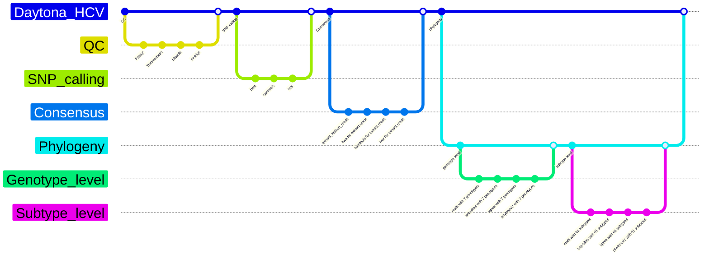

# Daytona_HCV        

## Introduction

This pipeline can perform the genotype detection and phylogeny analysis of Heptatits C virus (HCV). Illumina paired-end sequencing data are required for the pipeline. The phylogenetic relationship is built based on SNP sequences. 7 HCV genotypes and 61 HCV subtypes from NCBI are used as references to analyze phylogenetic relationship of the test samples.

## Prerequisites
Nextflow is needed. The details of installation can be found at https://github.com/nextflow-io/nextflow. For HiPerGator users, its installation is not needed. 

Singularity/APPTAINER is needed. The details of installation can be found at https://singularity-tutorial.github.io/01-installation/. For HiPerGator users, its installation is not needed.

SLURM is needed. For HiPerGator users, its installation is not needed.

Python3 is needed. The package "pandas" should be installed by ``` pip3 install pandas ``` if not included in your python3.

The Kraken2 database PlusPF is needed. For HiPerGator users, downloading is not needed. It has been downloaded and configured in the pipeline.

ivar is needed. The installation can be found at https://github.com/andersen-lab/ivar

PhyTreeViz is needed. The installation can be found at https://github.com/moshi4/phyTreeViz.

## Workflow



## Recommended conda environment installation
   ```bash
   conda create -n HCV -c conda-forge python=3.10
   ```
   ```bash
   conda activate HCV
   ```


## How to run

1. put your data files into the directory /fastqs/. Your data file's name should look like "XZA22002292_1.fastq.gz", "XZA22002292_2.fastq.gz". You may use the script <mark>***rename.sh***</mark> to rename your data files. 
2. open the file "params_hcv.yaml", and set the parameters absolute paths. They should be ".../.../fastqs", ".../.../output", etc. 
3. get into the top directory of the pipeline and then select one of the following commands to run.      
```bash
sbatch Daytona_HCV.sh   # generate phylogenetic tree at genotype level
sbatch Daytona_HCV.sh genotype   # generate phylogenetic tree at HCV genotype level
sbatch Daytona_HCV.sh subtype  # generate phylogenetic tree at HCV subtype level
sbatch Daytona_HCV.sh both  # generate phylogenetic trees at genotype level and subtype level
```       
## Main output
### 1. HCV reads detection      
|sampleID|k_species/percent(%)/number|...|        
|:---|:---|:---|             
|xxx25002686_S1|Hepacivirus hominis/0.07/875,Hepatitis C virus genotype 4/0.07/872,Hepatitis C virus genotype 6/0.00/2|...|       
                                              
The second column of the above table indicates that 875 reads (0.07%) in the sample (xxx25002686_S1) are identified as HCV species. Among it, 872 reads (0.07%) are identified as HCV genotype 4, while 2 reads (0.00%) are identified as HCV genotype 6. Note, the reason why the two percentages are the same is due to rounding. Similarly, the same reason applies to 0 percentage.      
### 2. Variants    
|REGION|POS|REF|ALT|...|PVAL|PASS|...|        
|:---|:---|:---|:---|:---|:---|:---|:---|             
|KC248195.1|28|T|C|...|0.16|FALSE|...|
|KC248195.1|107|G|A|...|0.04|TRUE|...|                   

PASS is the result of p-value <= 0.05. If a SNP's PASS value is FALSE, it fails to pass the quality check.      

### 3. Phylogenetic tree at genotype level

For the phylogenetic tree at genotype level, the test samples will be compared with 7 HCV genotypes. The phylogenetic bootstrap test with 1,000 replicate datasets will be performed to assess the statistical support for nodes (branches) on the phylogenetic tree.      


### 4. Phylogenetic tree at subtype level

For the phylogenetic tree at subtype level, the test samples will be compared with 61 HCV subtypes. The phylogenetic bootstrap test with 1,000 replicate datasets will be performed to assess the statistical support for nodes (branches) on the phylogenetic tree.        


## Test data
5 pairs of test fastq data can be found in /blue/bphl-florida/share/Daytona_HCV_test_sample. To use them, please copy them to the directory .../fastqs/hcv/.         

## Contact
If you want to report bugs, suggest enhancements, discuss ideas related to the project, please use the repository's "Issues" tab in GitHub.

### Note:      
If you want to get email notification when the pipeline running ends, please input your email address in the line "#SBATCH --mail-user=<EMAIL>" of Daytona_HCV.sh.  
