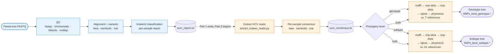

# Daytona_HCV

[](LICENSE)
[](CHANGELOG.md)
[](https://www.nextflow.io/)
[](https://apptainer.org/)

A Nextflow + SLURM pipeline for **genotype detection** and **SNP-based
phylogenetic analysis** of Hepatitis C virus (HCV) from Illumina
paired-end sequencing reads. Developed and maintained at the Bureau of
Public Health Laboratories (BPHL), Florida Department of Health.

> **v2.0.0 — Two-stage workflow.** The single `Daytona_HCV.sh` entry
> point has been split into `Daytona_HCV_part1_nextflow.sh` (Nextflow)
> and `Daytona_HCV_part2_phylogeny.sh` (phylogeny). See
> [`CHANGELOG.md`](CHANGELOG.md) for the full list of changes and
> migration notes.

---

## Contents

- [Overview](#overview)
- [Workflow](#workflow)
- [Requirements](#requirements)
- [Installation](#installation)
- [Configuration](#configuration)
- [Usage](#usage)
- [Output](#output)
- [Logs and troubleshooting](#logs-and-troubleshooting)
- [Test data for HiPerGator users](#test-data-for-hipergator-users)
- [Tools used](#tools-used)
- [Citation](#citation)
- [License](#license)
- [Contact](#contact)

---

## Overview

Daytona_HCV takes paired-end Illumina FASTQ reads and produces:

- A per-sample summary of HCV reads classified by Kraken2 (PlusPF database).
- Per-sample SNP variants against reference **KC248195.1**.
- Per-sample consensus FASTA for the dominant HCV genotype/subtype.
- A SNP-based maximum-likelihood phylogenetic tree at:
  - **Genotype level** — vs. 7 HCV reference genotypes (NCBI), or
  - **Subtype level** — vs. 61 HCV reference subtypes (NCBI), or
  - **Both**.
- 1,000-replicate bootstrap support values on every internal node.

The pipeline runs as **two SLURM jobs**:

| Stage  | Script                            | Purpose                                                                         |
| ------ | --------------------------------- | ------------------------------------------------------------------------------- |
| Part 1 | `Daytona_HCV_part1_nextflow.sh`   | Nextflow: QC → alignment → variants → per-sample reports + `sum_report.txt`     |
| Part 2 | `Daytona_HCV_part2_phylogeny.sh`  | Extract HCV reads → consensus → mafft → snp-sites → iqtree → phytreeviz         |

Splitting the workflow makes it possible to re-run only the phylogeny
stage (e.g. switching between genotype/subtype levels) without paying
the cost of re-running QC and alignment.

---

## Workflow


```mermaid
flowchart LR
    A([Paired-end FASTQ]) --> B[QC<br/>fastqc · trimmomatic · bbtools · multiqc]
    B --> C[Alignment + variants<br/>bwa · samtools · ivar]
    C --> D[Kraken2 classification<br/>per-sample report]
    D --> E[(sum_report.txt)]

    E -.->|Part 1 ends, Part 2 begins| F

    F[Extract HCV reads<br/>extract_kraken_reads.py] --> G[Per-sample consensus<br/>bwa · samtools · ivar]
    G --> H[(sum_consensus.fa)]
    H --> I{Phylogeny level}
    I -->|genotype| J[mafft → snp-sites → snp-dists<br/>→ iqtree → phytreeviz<br/>vs. 7 references]
    I -->|subtype| K[mafft → snp-sites → snp-dists<br/>→ iqtree → phytreeviz<br/>vs. 61 references]
    I -->|both| J & K
    J --> L([Genotype tree<br/>SNPs_boot_genotype.*])
    K --> M([Subtype tree<br/>SNPs_boot_subtype.*])

    classDef stage1 fill:#e3f2fd,stroke:#1976d2,stroke-width:1px
    classDef stage2 fill:#fff3e0,stroke:#f57c00,stroke-width:1px
    class A,B,C,D stage1
    class F,G,J,K stage2
```

Blue = Part 1 (Nextflow). Orange = Part 2 (phylogeny).

---

## Requirements

| Component        | HiPerGator users        | Other systems                                                                   |
| ---------------- | ----------------------- | ------------------------------------------------------------------------------- |
| Nextflow ≥ 23.04 | Pre-installed           | [Install](https://www.nextflow.io/docs/latest/getstarted.html#installation)     |
| Apptainer/Singularity | Pre-installed      | [Install](https://apptainer.org/docs/admin/main/installation.html)              |
| SLURM            | Pre-installed           | Required for `sbatch`                                                           |
| Python ≥ 3.10    | `module load python`    | Plus `pip install pandas biopython`                                             |
| Kraken2 PlusPF DB| Pre-configured          | [Download (~80 GB)](https://benlangmead.github.io/aws-indexes/k2) and set path in `params_hcv.yaml` |

> **HiPerGator note.** All container images are pulled from `staphb/*`
> Docker images via Apptainer; this requires outbound network access on
> the compute node. On HiPerGator this works out of the box.

---

## Installation

```bash
# Clone the repository
git clone https://github.com/BPHL-Molecular/Daytona_HCV.git
cd Daytona_HCV

# Create and activate the conda environment
conda create -n HCV -c conda-forge python=3.10 pandas biopython -y
conda activate HCV
```

Optionally make the SLURM scripts executable:

```bash
chmod +x Daytona_HCV_part1_nextflow.sh Daytona_HCV_part2_phylogeny.sh
```

### Repository layout

```
Daytona_HCV/
├── Daytona_HCV_part1_nextflow.sh    # SLURM job: Nextflow stage
├── Daytona_HCV_part2_phylogeny.sh   # SLURM job: phylogeny stage
├── hcv.nf                           # Nextflow main workflow
├── modules/                         # Nextflow process modules
├── params_hcv.yaml                  # Pipeline parameters (edit me)
├── braken_phy.py                    # HCV consensus + phylogeny driver
├── extract_kraken_reads.py          # Kraken2 read extractor
├── reference/
│   ├── hcv/                         # KC248195 reference FASTA + index
│   └── HCV_align/                   # Pre-aligned 7-genotype / 61-subtype MSAs
├── fastqs/hcv/                      # Place your input FASTQs here
├── rename.sh                        # Helper to rename FASTQs to the expected pattern
├── CHANGELOG.md
├── LICENSE
└── README.md
```

---

## Configuration

### 1. Prepare input FASTQs

Place paired-end FASTQ files in `fastqs/hcv/`. File names must match the
pattern `<sampleID>_1.fastq.gz` / `<sampleID>_2.fastq.gz`, e.g.

```
fastqs/hcv/XZA22002292_1.fastq.gz
fastqs/hcv/XZA22002292_2.fastq.gz
```

If your file names follow a different convention, use the included
[`rename.sh`](rename.sh) helper.

> ⚠️ **Do not place FASTQ files outside `fastqs/hcv/`.** The pipeline
> resolves input paths relative to this directory, and other locations
> will cause runtime errors.

### 2. Edit `params_hcv.yaml`

Open `params_hcv.yaml` and set all paths to **absolute** paths, e.g.

```yaml
input:    /blue/.../Daytona_HCV/fastqs/hcv
output:   /blue/.../Daytona_HCV/output
# ... etc.
```

### 3. (Optional) Email notifications

Add your address to the `#SBATCH --mail-user=` line of **both**
`Daytona_HCV_part1_nextflow.sh` and `Daytona_HCV_part2_phylogeny.sh`.
Each part is a separate SLURM job and produces its own notification.

---

## Usage

From the top directory of the pipeline, choose one of the following
submission patterns.

### Option A — Manual two-step (simplest)

```bash
# Stage 1: Nextflow + sum_report.txt
sbatch Daytona_HCV_part1_nextflow.sh

# After Part 1 completes, pick one:
sbatch Daytona_HCV_part2_phylogeny.sh           # default: genotype (7 references)
sbatch Daytona_HCV_part2_phylogeny.sh genotype  # 7 HCV genotypes as references
sbatch Daytona_HCV_part2_phylogeny.sh subtype   # 61 HCV subtypes as references
sbatch Daytona_HCV_part2_phylogeny.sh both      # both genotype and subtype trees
```

### Option B — Chained submission (recommended)

Use a SLURM dependency so Part 2 only starts if Part 1 succeeded:

```bash
P1=$(sbatch --parsable Daytona_HCV_part1_nextflow.sh)
sbatch --dependency=afterok:$P1 Daytona_HCV_part2_phylogeny.sh both
```

### Option C — Re-run only the phylogeny stage

If Part 1 already finished and you want to re-render trees at a
different level (e.g., you ran `genotype` and now also want `subtype`),
re-submit Part 2 with the new argument. **As long as `./output/` has not
yet been renamed to `./output-<timestamp>/`** (which happens at the end
of Part 2), the phylogeny will be rebuilt from the existing consensus
FASTAs without re-running Nextflow:

```bash
sbatch Daytona_HCV_part2_phylogeny.sh subtype
```

---

## Output

After a successful run, the working directory `./output` is renamed to
`./output-<timestamp>` and contains:

```
output-<timestamp>/
├── hepatitis_pipeline.out         # Merged stdout from Part 1 + Part 2
├── hepatitis_pipeline.err         # Merged stderr from Part 1 + Part 2
├── sum_report.txt                 # Per-sample HCV classification summary
├── <sampleID_1>/                  # Per-sample Nextflow outputs
│   ├── kraken_out/
│   ├── variants/
│   └── report.txt
├── <sampleID_2>/
│   └── ...
├── extract/                       # Per-sample consensus FASTAs + intermediate BAMs
│   ├── <sampleID>_<taxID>.consensus.fa
│   └── sum_consensus.fa
├── trees/                         # SNP alignments + tree files + visualizations
│   ├── SNPs_genotype.fasta
│   ├── SNPs_boot_genotype.contree
│   ├── SNPs_boot_genotype.contree.pdf
│   ├── SNPs_boot_genotype.contree.png
│   ├── pairwise_matrix_genotype.tsv
│   ├── mafft_genotype_msa
│   └── (same set of files for *_subtype if requested)
└── logs/
    ├── braken_phy_<TS>.log         # Full braken_phy.py stdout+stderr (shell-captured)
    ├── braken_phy_<TS>.err         # braken_phy.py stderr only (shell-captured)
    └── braken_phy_py_<TS>.log      # Python-side structured log (timestamped + leveled)
```

### Key files

**1. `sum_report.txt` — HCV reads detection**

| sampleID        | k_species &#124; tax_ID &#124; percent &#124; number                                                   | reference  | ... |
| --------------- | ------------------------------------------------------------------------------------------------------ | ---------- | --- |
| xxx25002686_S1  | Hepacivirus hominis/0.07/875,Hepatitis C virus genotype 4/0.07/872,Hepatitis C virus genotype 6/0.00/2 | KC248195.1 | ... |

The species column shows the Kraken2 hierarchy: total HCV reads first,
then per-genotype breakdown. In the example above, 875 reads (0.07%)
classify as HCV; of those, 872 reads classify as genotype 4 and 2 reads
as genotype 6. (Matching percentages are due to rounding.)

**2. Variants (`<sampleID>/variants/*.tsv`)**

| REGION     | POS | REF | ALT | ... | PVAL | PASS  |
| ---------- | --- | --- | --- | --- | ---- | ----- |
| KC248195.1 | 28  | T   | C   | ... | 0.16 | FALSE |
| KC248195.1 | 107 | G   | A   | ... | 0.04 | TRUE  |

`PASS = TRUE` when `PVAL ≤ 0.05`. `FALSE` rows are reported but failed
quality control.

**3. Phylogenetic trees (`trees/`)**

| File                              | Description                                              |
| --------------------------------- | -------------------------------------------------------- |
| `SNPs_boot_genotype.contree`      | Maximum-likelihood consensus tree (Newick)               |
| `SNPs_boot_genotype.contree.pdf`  | Visualization with bootstrap support labels              |
| `SNPs_boot_genotype.contree.png`  | Same, as PNG                                             |
| `pairwise_matrix_genotype.tsv`    | Pairwise SNP distance matrix                             |
| `mafft_genotype_msa`              | MAFFT alignment of consensus + reference panel           |
| `SNPs_genotype.fasta`             | SNP-only alignment fed to IQ-TREE                        |

Subtype-level outputs follow the same naming with `_subtype` in place
of `_genotype`. Bootstrap support is computed from 1,000 ultra-fast
bootstrap replicates (`iqtree -bb 1000 -alrt 1000`).

---

## Logs and troubleshooting

Both SLURM jobs append to the **same** merged log file
(`hepatitis_pipeline.out` / `.err`) so the full chronological history
of a run is in one place. Inside that, `braken_phy.py` emits structured
log lines via Python's `logging` module:

```
2026-05-20 14:23:01 [INFO   ] [xxx25002686_S1/bwa_mem] RUN: singularity exec docker://staphb/bwa:0.7.17 bwa mem ...
2026-05-20 14:23:47 [INFO   ] [xxx25002686_S1/bwa_mem] OK exit=0 (46.2s)
2026-05-20 14:23:47 [INFO   ] [xxx25002686_S1/samtools_view] RUN: ...
```

If Part 2 aborts, check these files in order:

1. **`hepatitis_pipeline.err`** — most recent `[ERROR]` line points to
   the failing sample + step (e.g. `[xxx25002686_S1/bwa_mem] FAILED exit=1`).
2. **`logs/braken_phy_py_<TS>.log`** — the Python-side structured log,
   including any traceback.
3. **`logs/braken_phy_<TS>.err`** — the underlying tool's raw stderr
   (mafft, iqtree, samtools, etc.).

### Common issues

| Symptom                                                                          | Likely cause                                                         | Fix                                                                  |
| -------------------------------------------------------------------------------- | -------------------------------------------------------------------- | -------------------------------------------------------------------- |
| `ERROR: ./output directory not found`                                            | Part 2 submitted before Part 1 finished                              | Wait for Part 1, or use `--dependency=afterok` (Option B above)     |
| `No Hepatitis C virus genotype found in <sample>` warnings                       | Sample failed Kraken2 HCV classification                             | Inspect `<sample>/kraken_out/`; sample is skipped, others continue   |
| `FAILED exit=N` from `singularity exec ...`                                      | Container image pull failed, or out-of-memory in tool                | Check internet/cache on compute node; raise `--mem` in Part 2        |
| `iqtree` runs but produces no `.contree` file                                    | Too few informative sites in SNP alignment                           | Check that more than one HCV-positive sample contributed             |
| Part 2 fast-fails immediately after submission                                   | Missing input file (kraken_out, fastq, reference) — logged by name   | Restore the file or re-run Part 1                                    |

---

## Test data for HiPerGator users

Five pairs of test FASTQ files are available at:

```
/blue/bphl-florida/share/Daytona_HCV_test_sample/
```

Copy them into `fastqs/hcv/` and run the standard two-stage workflow.

---

## Tools used

This pipeline is a thin orchestration layer over the following
open-source tools (all pulled as `staphb/*` Docker images via Apptainer):

| Tool         | Version | Purpose                                  |
| ------------ | ------- | ---------------------------------------- |
| Nextflow     | ≥ 23.04 | Workflow engine                          |
| FastQC       | latest  | Read QC                                  |
| Trimmomatic  | latest  | Adapter/quality trimming                 |
| BBTools      | latest  | Read filtering                           |
| MultiQC      | latest  | Aggregate QC report                      |
| Kraken2      | latest  | Taxonomic classification (PlusPF DB)     |
| BWA          | 0.7.17  | Read alignment                           |
| SAMtools     | 1.12    | BAM manipulation                         |
| iVar         | latest  | Variant calling + consensus              |
| MAFFT        | latest  | Multiple sequence alignment              |
| SNP-sites    | 2.3.3   | Extract SNP positions from MSA           |
| SNP-dists    | 0.6.2   | Pairwise SNP distance matrix             |
| IQ-TREE      | 1.6.7   | Maximum-likelihood phylogeny + bootstrap |
| phytreeviz   | latest  | Tree visualization (PDF/PNG)             |

Please cite the original tool authors in addition to this pipeline when
publishing results.

---

## Citation

If you use Daytona_HCV in published research, please cite the GitHub
repository:

> BPHL-Molecular. *Daytona_HCV: a pipeline for genotype detection and
> SNP-based phylogenetic analysis of Hepatitis C virus.* Florida
> Department of Health, Bureau of Public Health Laboratories.
> https://github.com/BPHL-Molecular/Daytona_HCV

A BibTeX entry will be added when a permanent DOI is registered.

---

## License

Released under the [MIT License](LICENSE).

---

## Contact

- **Bugs, feature requests, ideas:** open an issue on the
  [GitHub Issues tab](https://github.com/BPHL-Molecular/Daytona_HCV/issues).
- **Pull requests welcome.** Please run `bash -n` on shell scripts and
  `python3 -m py_compile braken_phy.py` before submitting.
